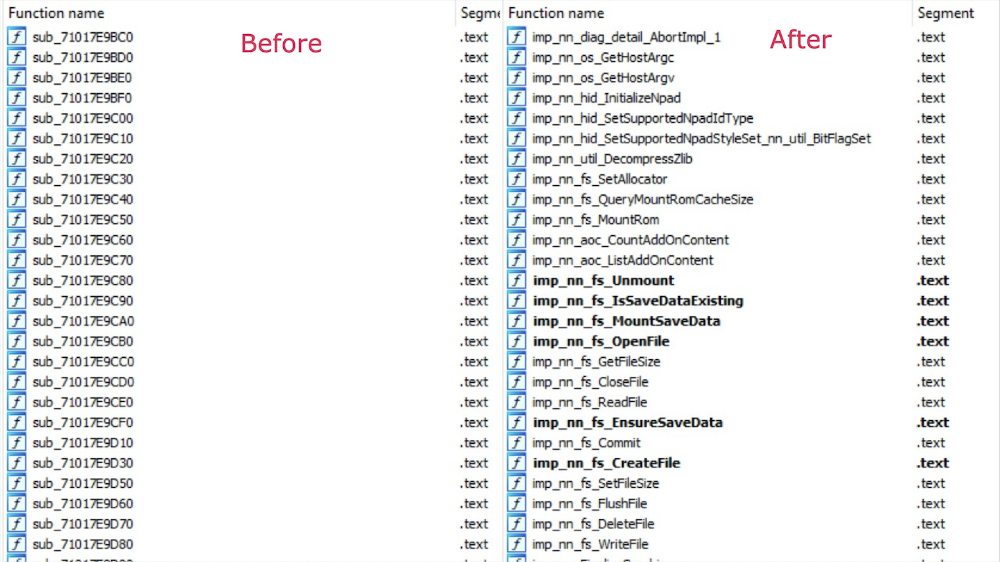

# Switch Import Renamer

Switch Import Renamer is an IDAPython script to rename the stub functions that call imported library functions in Nintendo Switch executables.

## Installation

Open the `switch_import_renamer.py` script from IDA to run.

## Screenshots

## Contributing
Pull requests are welcome. Please open an issue first to discuss what you would like to change.

## License
[MIT](LICENSE)
